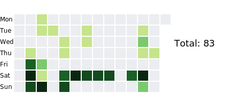

# Coding_Practice

## 統計

## Daily Solved Problems

## 計畫

| 周次 | 開始 | 結束 | 事項 | 累積題數 |
| - | - | - | - | - |
| 0 | 3/8 | 3/14 | 開始 | 6 |
| 1 |3/15 | 3/21 | 基礎dp + ABC + CF div2
| 2 |3/22 | 4/4 | 基礎圖論+ ABC + CF div2
| 3 |4/5  | 4/11 | 基礎dp + ABC + CF div2
| 4 |4/12 | 4/18| 基礎圖論 + ABC + CF div2
| 5 |4/19 | 4/25| 進階dp + ABC + CF div2
| 6 |4/26 | 5/2 | 進階圖論+ ABC + CF div2
| 7 |5/3  | 5/9| 最短路 + ABC + CF div2
| 8 |5/10 | 5/16| 二分搜 + ABC + CF div2
| 9 |5/17 | 5/23| 數學 + ABC + CF div2
| 10 |5/24 | 5/30| 進階dp + ABC + CF div2
| 11 |5/31 | 6/6| 進階圖論 + ABC + CF div2
| 12 |6/7  | 6/13| 最短路 + ABC + CF div2
| 13 |6/14 | 6/20| 二分搜 + ABC + CF div2
| 14 |6/21 | 6/27| 數學 + ABC + CF div2
| 15 |6/28 | 7/4| 資料結構 + ABC + CF div2
| 16 |7/5  | 7/11| 進階資料結構 + ABC + CF div2
| 17 |7/12 | 7/18| + ABC + CF div2
| 18 |7/19 | 7/25| + ABC + CF div2
| 19 |7/26 | 8/1| + ABC + CF div2
| 20 |8/2  | 8/8| + ABC + CF div2
| 21 |8/9  | 8/15| + ABC + CF div2
| 22 |8/16 | 8/22| + ABC + CF div2
| 23 |8/23 | 8/39| + ABC + CF div2
| 24 |8/30 | 9/5| + ABC + CF div2
| 25 |9/6  | 9/12| + ABC + CF div2
| 26 |9/13 | 9/19| + ABC + CF div2
| 27 |9/20 | 9/26| + ABC + CF div2
| 28 |9/27 | 10/3| + ABC + CF div2
| 29 |10/4  | 10/10| 歷屆 |
| 30 |10/11 |10/17| 歷屆 |
| 31 |10/18 |10/24| 歷屆 |
| 32 |10/25 | 10/31 | 歷屆 |
| 33 | 11/1 | 11/7 | 歷屆 |
| 34 | 11/8 | 11/14 | 歷屆 |
| 35 | 11/15 | 11/21 | 歷屆 |
| 36 | 11/22 | 11/28 | 歷屆 |
| 37 | 11/29 | 12/5 | 歷屆 |
| 38 | 12/6 | 12/12 | 歷屆 |

預期題數： $38 \times (7 + 5) = 456$

<!-- STATS_START -->

| 題型 | 次數 |
| - | - |
| BIT | 1 |
| DSU | 1 |
| LCA | 1 |
| lower/upper_bound() | 1 |
| 二元枚舉 | 1 |
| 位元 | 1 |
| 前綴和 | 1 |
| 區間 | 1 |
| 字串Hash | 1 |
| 幾何 | 1 |
| 循環節 | 1 |
| 折半枚舉 | 1 |
| 拓鋪排序 | 1 |
| 斜率二分搜 | 1 |
| 枚舉所有因數(公式) | 1 |
| 模運算 | 1 |
| 樹dp | 1 |
| 矩陣快速冪 | 1 |
| 等價類計數 | 1 |
| 簡易樹論 | 1 |
<!-- STATS_END -->
