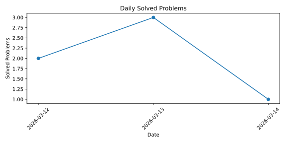

# Coding_Practice

## 統計

## Daily Solved Problems

<!-- STATS_START -->

| 題型 | 次數 |
| - | - |
| DSU | 1 |
| LCA | 1 |
| 二元枚舉 | 1 |
| 位元 | 1 |
| 前綴和 | 1 |
| 字串Hash | 1 |
| 折半枚舉 | 1 |
| 拓鋪排序 | 1 |
| 斜率二分搜 | 1 |
| 枚舉所有因數(公式) | 1 |
| 樹dp | 1 |
<!-- STATS_END -->