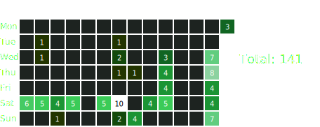

# Coding_Practice

## 統計

## Daily Solved Problems

預期題數： $38 \times (7 + 5) = 456$

<!-- STATS_START -->

| 知識點 | 題數 | 已評分 | 獨立 | 理解 | 實作 | 辨識 | 熟練度 | 等級 | 常見錯誤 | 最近練習 |
| --- | ---: | ---: | ---: | ---: | ---: | ---: | ---: | --- | --- | --- |
| `alternating_color_path` | 0 | 0 | - | - | - | - | - | 尚未使用 | - | - |
| `answer_enumeration` | 0 | 0 | - | - | - | - | - | 尚未使用 | - | - |
| `average_extremum` | 0 | 0 | - | - | - | - | - | 尚未使用 | - | - |
| `bellman_ford` | 0 | 0 | - | - | - | - | - | 尚未使用 | - | - |
| `binary_lifting` | 0 | 0 | - | - | - | - | - | 尚未使用 | - | - |
| `binary_search_on_sparse_table` | 0 | 0 | - | - | - | - | - | 尚未使用 | - | - |
| `binary_tree` | 0 | 0 | - | - | - | - | - | 尚未使用 | - | - |
| `bit_functions` | 0 | 0 | - | - | - | - | - | 尚未使用 | - | - |
| `bitwise_operators` | 0 | 0 | - | - | - | - | - | 尚未使用 | - | - |
| `carry_system` | 0 | 0 | - | - | - | - | - | 尚未使用 | - | - |
| `cycle_dp` | 0 | 0 | - | - | - | - | - | 尚未使用 | - | - |
| `difference_on_tree` | 0 | 0 | - | - | - | - | - | 尚未使用 | - | - |
| `discretization` | 0 | 0 | - | - | - | - | - | 尚未使用 | - | - |
| `distinct_value_queries` | 0 | 0 | - | - | - | - | - | 尚未使用 | - | - |
| `divide_and_conquer` | 0 | 0 | - | - | - | - | - | 尚未使用 | - | - |
| `dsu` | 0 | 0 | - | - | - | - | - | 尚未使用 | - | - |
| `dynamic_kth_extremum` | 0 | 0 | - | - | - | - | - | 尚未使用 | - | - |
| `expected_value` | 0 | 0 | - | - | - | - | - | 尚未使用 | - | - |
| `fenwick_tree` | 0 | 0 | - | - | - | - | - | 尚未使用 | - | - |
| `floyd_warshall` | 0 | 0 | - | - | - | - | - | 尚未使用 | - | - |
| `game_theory_dp` | 0 | 0 | - | - | - | - | - | 尚未使用 | - | - |
| `gcd` | 0 | 0 | - | - | - | - | - | 尚未使用 | - | - |
| `hash_table` | 0 | 0 | - | - | - | - | - | 尚未使用 | - | - |
| `hex_map_implementation` | 0 | 0 | - | - | - | - | - | 尚未使用 | - | - |
| `kth_extremum` | 0 | 0 | - | - | - | - | - | 尚未使用 | - | - |
| `kth_shortest_path` | 0 | 0 | - | - | - | - | - | 尚未使用 | - | - |
| `lcm` | 0 | 0 | - | - | - | - | - | 尚未使用 | - | - |
| `lcs` | 0 | 0 | - | - | - | - | - | 尚未使用 | - | - |
| `median_extremum` | 0 | 0 | - | - | - | - | - | 尚未使用 | - | - |
| `meet_in_the_middle_enumeration` | 0 | 0 | - | - | - | - | - | 尚未使用 | - | - |
| `memoized_search` | 0 | 0 | - | - | - | - | - | 尚未使用 | - | - |
| `micro_scan_line` | 0 | 0 | - | - | - | - | - | 尚未使用 | - | - |
| `minimax_problems` | 0 | 0 | - | - | - | - | - | 尚未使用 | - | - |
| `minimum_cycle` | 0 | 0 | - | - | - | - | - | 尚未使用 | - | - |
| `monotonicity_extremum` | 0 | 0 | - | - | - | - | - | 尚未使用 | - | - |
| `mst` | 0 | 0 | - | - | - | - | - | 尚未使用 | - | - |
| `multiple_enumeration` | 0 | 0 | - | - | - | - | - | 尚未使用 | - | - |
| `negative_cycle` | 0 | 0 | - | - | - | - | - | 尚未使用 | - | - |
| `order_statistic_tree` | 0 | 0 | - | - | - | - | - | 尚未使用 | - | - |
| `pairing_greedy` | 0 | 0 | - | - | - | - | - | 尚未使用 | - | - |
| `palindrome_problems` | 0 | 0 | - | - | - | - | - | 尚未使用 | - | - |
| `partition_dp` | 0 | 0 | - | - | - | - | - | 尚未使用 | - | - |
| `path_on_grid_dp` | 0 | 0 | - | - | - | - | - | 尚未使用 | - | - |
| `permutation` | 0 | 0 | - | - | - | - | - | 尚未使用 | - | - |
| `prefix_xor` | 0 | 0 | - | - | - | - | - | 尚未使用 | - | - |
| `prime` | 0 | 0 | - | - | - | - | - | 尚未使用 | - | - |
| `probability` | 0 | 0 | - | - | - | - | - | 尚未使用 | - | - |
| `pruning` | 0 | 0 | - | - | - | - | - | 尚未使用 | - | - |
| `range_greedy` | 0 | 0 | - | - | - | - | - | 尚未使用 | - | - |
| `recursive_enumeration` | 0 | 0 | - | - | - | - | - | 尚未使用 | - | - |
| `rmq` | 0 | 0 | - | - | - | - | - | 尚未使用 | - | - |
| `sliding_window` | 0 | 0 | - | - | - | - | - | 尚未使用 | - | - |
| `sparse_table` | 0 | 0 | - | - | - | - | - | 尚未使用 | - | - |
| `state_compression` | 0 | 0 | - | - | - | - | - | 尚未使用 | - | - |
| `state_compression_dp` | 0 | 0 | - | - | - | - | - | 尚未使用 | - | - |
| `steiner_tree` | 0 | 0 | - | - | - | - | - | 尚未使用 | - | - |
| `subsequence_greedy` | 0 | 0 | - | - | - | - | - | 尚未使用 | - | - |
| `subtree_merge_dp` | 0 | 0 | - | - | - | - | - | 尚未使用 | - | - |
| `swap_linked_technique` | 0 | 0 | - | - | - | - | - | 尚未使用 | - | - |
| `ternary_search` | 0 | 0 | - | - | - | - | - | 尚未使用 | - | - |
| `topological_sort` | 0 | 0 | - | - | - | - | - | 尚未使用 | - | - |
| `tree_dp` | 0 | 0 | - | - | - | - | - | 尚未使用 | - | - |
| `graph` | 3 | 3 | 5.0/5 | 5.0/5 | 5.0/5 | 5.0/5 | 100.0% | 精通 | - | 2026-07-08 |
| `bit_enumeration` | 2 | 2 | 5.0/5 | 5.0/5 | 5.0/5 | 5.0/5 | 100.0% | 精通 | - | 2026-07-01 |
| `equation_optimize` | 2 | 2 | 5.0/5 | 5.0/5 | 5.0/5 | 5.0/5 | 100.0% | 精通 | - | 2026-07-09 |
| `interactive` | 2 | 2 | 5.0/5 | 5.0/5 | 5.0/5 | 5.0/5 | 100.0% | 精通 | debugging_slow(1) | 2026-07-11 |
| `bfs` | 1 | 1 | 5.0/5 | 5.0/5 | 5.0/5 | 5.0/5 | 100.0% | 精通 | - | 2026-05-31 |
| `custom_containers` | 1 | 1 | 5.0/5 | 5.0/5 | 5.0/5 | 5.0/5 | 100.0% | 精通 | - | 2026-04-25 |
| `different_side_two_pointer` | 1 | 1 | 5.0/5 | 5.0/5 | 5.0/5 | 5.0/5 | 100.0% | 精通 | - | 2026-07-04 |
| `knapsack_problems` | 1 | 1 | 5.0/5 | 5.0/5 | 5.0/5 | 5.0/5 | 100.0% | 精通 | - | 2026-07-09 |
| `modulo` | 1 | 1 | 5.0/5 | 5.0/5 | 5.0/5 | 5.0/5 | 100.0% | 精通 | - | 2026-05-31 |
| `muiti_source` | 1 | 1 | 5.0/5 | 5.0/5 | 5.0/5 | 5.0/5 | 100.0% | 精通 | reading_misunderstanding(1), template_not_familiar(1) | 2026-06-11 |
| `priority_queue` | 1 | 1 | 5.0/5 | 5.0/5 | 5.0/5 | 5.0/5 | 100.0% | 精通 | - | 2026-07-09 |
| `sequence_containers` | 1 | 1 | 5.0/5 | 5.0/5 | 5.0/5 | 5.0/5 | 100.0% | 精通 | - | 2026-07-02 |
| `stack` | 1 | 1 | 5.0/5 | 5.0/5 | 5.0/5 | 5.0/5 | 100.0% | 精通 | - | 2026-07-09 |
| `structural_bounds` | 1 | 1 | 5.0/5 | 5.0/5 | 5.0/5 | 5.0/5 | 100.0% | 精通 | - | 2026-07-13 |
| `graph_modeling` | 4 | 4 | 5.0/5 | 4.8/5 | 5.0/5 | 5.0/5 | 98.8% | 精通 | - | 2026-07-12 |
| `lower_upper_bound` | 2 | 2 | 5.0/5 | 5.0/5 | 5.0/5 | 4.5/5 | 98.0% | 精通 | - | 2026-07-02 |
| `sort` | 2 | 2 | 5.0/5 | 5.0/5 | 5.0/5 | 4.5/5 | 98.0% | 精通 | - | 2026-06-13 |
| `dijkstra` | 2 | 2 | 5.0/5 | 4.5/5 | 5.0/5 | 5.0/5 | 97.5% | 精通 | reading_misunderstanding(1), template_not_familiar(1) | 2026-07-12 |
| `same_side_two_pointer` | 3 | 3 | 5.0/5 | 4.7/5 | 5.0/5 | 4.7/5 | 97.0% | 精通 | debugging_slow(1), overcomplicated_solution(1), wrong_idea(1) | 2026-07-11 |
| `dfs` | 8 | 8 | 5.0/5 | 4.8/5 | 4.6/5 | 5.0/5 | 96.9% | 精通 | reading_misunderstanding(1) | 2026-07-08 |
| `difference` | 2 | 2 | 5.0/5 | 5.0/5 | 5.0/5 | 4.0/5 | 96.0% | 精通 | overcomplicated_solution(1) | 2026-06-13 |
| `greedy` | 16 | 16 | 4.8/5 | 4.7/5 | 4.8/5 | 4.9/5 | 95.8% | 精通 | debugging_slow(1), overcomplicated_solution(1), special_case_not_found(1) | 2026-07-13 |
| `geometry` | 1 | 1 | 5.0/5 | 5.0/5 | 4.0/5 | 5.0/5 | 95.0% | 精通 | integer_overflow(1) | 2026-05-31 |
| `monotonic_sequence` | 1 | 1 | 5.0/5 | 5.0/5 | 4.0/5 | 5.0/5 | 95.0% | 精通 | - | 2026-04-18 |
| `range_dp` | 5 | 5 | 4.0/5 | 5.0/5 | 5.0/5 | 5.0/5 | 94.0% | 精通 | constant(1) | 2026-07-15 |
| `binary_search` | 1 | 1 | 4.0/5 | 5.0/5 | 5.0/5 | 5.0/5 | 94.0% | 精通 | - | 2026-07-15 |
| `matrix` | 1 | 1 | 4.0/5 | 5.0/5 | 5.0/5 | 5.0/5 | 94.0% | 精通 | - | 2026-07-12 |
| `parity` | 1 | 1 | 4.0/5 | 5.0/5 | 5.0/5 | 5.0/5 | 94.0% | 精通 | debugging_slow(1), off_by_one(1), too_slow_solving(1) | 2026-07-11 |
| `associative_containers` | 4 | 4 | 4.5/5 | 4.8/5 | 4.8/5 | 4.8/5 | 93.5% | 精通 | - | 2026-07-11 |
| `find_cycle` | 1 | 1 | 5.0/5 | 4.0/5 | 4.0/5 | 5.0/5 | 90.0% | 精通 | - | 2026-05-02 |
| `implementation` | 1 | 1 | 5.0/5 | 4.0/5 | 4.0/5 | 5.0/5 | 90.0% | 精通 | reading_misunderstanding(1) | 2026-06-12 |
| `binary_search_on_segment_tree` | 1 | 1 | 3.0/5 | 5.0/5 | 5.0/5 | 5.0/5 | 88.0% | 熟練 | - | 2026-07-10 |
| `digit_dp` | 1 | 1 | 3.0/5 | 5.0/5 | 5.0/5 | 5.0/5 | 88.0% | 熟練 | - | 2026-07-11 |
| `dp` | 6 | 6 | 4.2/5 | 4.7/5 | 4.7/5 | 3.8/5 | 87.0% | 熟練 | wrong_idea(2), debugging_slow(1), not_learned(1) | 2026-07-12 |
| `counting_equivalent_states` | 2 | 2 | 4.0/5 | 5.0/5 | 4.0/5 | 4.5/5 | 87.0% | 熟練 | debugging_slow(1), overcomplicated_solution(1) | 2026-07-06 |
| `segment_tree` | 5 | 5 | 2.6/5 | 5.0/5 | 5.0/5 | 5.0/5 | 85.6% | 熟練 | */(1) | 2026-07-10 |
| `complicated_implementation` | 1 | 1 | 5.0/5 | 4.0/5 | 3.0/5 | 5.0/5 | 85.0% | 熟練 | reading_misunderstanding(1) | 2026-06-12 |
| `tree` | 1 | 1 | 5.0/5 | 4.0/5 | 3.0/5 | 5.0/5 | 85.0% | 熟練 | reading_misunderstanding(1) | 2026-06-12 |
| `inclusion_exclusion` | 1 | 1 | 3.0/5 | 5.0/5 | 5.0/5 | 4.0/5 | 84.0% | 熟練 | - | 2026-04-26 |
| `2d_map_implementation` | 4 | 4 | 4.0/5 | 4.0/5 | 4.0/5 | 4.8/5 | 83.0% | 熟練 | not_learned(1), overcomplicated_solution(1) | 2026-06-13 |
| `1d_prefix_sum` | 4 | 4 | 4.0/5 | 4.0/5 | 4.0/5 | 4.5/5 | 82.0% | 熟練 | debugging_slow(1), not_learned(1), overcomplicated_solution(1) | 2026-07-12 |
| `lca` | 1 | 1 | 5.0/5 | 3.0/5 | 5.0/5 | 1.0/5 | 74.0% | 可使用 | wrong_recognition(1) | 2026-07-04 |
| `weighted_interval_scheduling_dp` | 1 | 1 | 3.0/5 | 5.0/5 | 5.0/5 | 1.0/5 | 72.0% | 可使用 | not_learned(1), overcomplicated_solution(1) | 2026-06-12 |
| `2d_prefix_sum` | 1 | 1 | 1.0/5 | 2.0/5 | 2.0/5 | 4.0/5 | 42.0% | 學習中 | not_learned(1) | 2026-06-06 |
| `combinatorics` | 1 | 1 | 1.0/5 | 2.0/5 | 2.0/5 | 4.0/5 | 42.0% | 學習中 | not_learned(1) | 2026-05-16 |

<!-- STATS_END -->

<!-- MISTAKES_START -->

| 錯誤類型 | 次數 |
| --- | ---: |
| `overcomplicated_solution` | 6 |
| `debugging_slow` | 4 |
| `not_learned` | 3 |
| `reading_misunderstanding` | 3 |
| `wrong_idea` | 3 |
| `*/` | 1 |
| `constant` | 1 |
| `integer_overflow` | 1 |
| `off_by_one` | 1 |
| `special_case_not_found` | 1 |
| `template_not_familiar` | 1 |
| `too_slow_solving` | 1 |
| `wrong_greedy_choice` | 1 |
| `wrong_recognition` | 1 |

<!-- MISTAKES_END -->