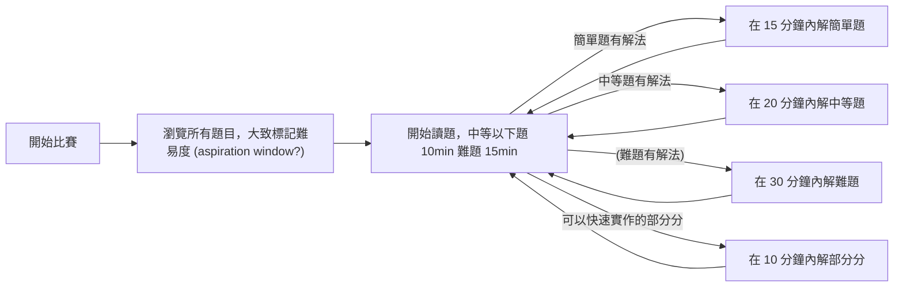

# 競賽策略 Contest Technique

## 這個 skill 解決什麼問題？

實際競賽時，出現以下問題：

1. **未抓出簡單題**予以實作。
2. **未抓出次簡單題**，多給予時間思考與實作。
3. **卡在同一題過久**，以至於沒有時間解其他題目。
4. **抓錯過久**，以至於根本沒發現想法就是錯的。

## 使用時機

實體或虛擬競賽時。

## 核心想法

以西洋棋引擎的搜尋模式解題。先標記難易度，再分別調整所需時間，記得注意時間是否過久，並快速跳題。

## 思考流程

## Agent Prompt

> 請你扮演這個 skill 的教練，按照本文的思考流程分析一場競賽的策略是否需要改進。
