# 除草

## 題目敘述

- [原題連結](https://oj.ntucpc.org/problems/1474)

## 提示

::: details Hint 1
兩人所走的路徑，除了完全分開，還有可能怎麼走？
:::

::: details Hint 2
如果兩人走到一起，分開後，還有可能再走到一起嗎？
:::

::: details Hint 3
該如何枚舉，才能快速求出一種走法？
:::

::: details Hint 4
該如何求出，從某一點開始一起走，並在某個點分開，兩人走的最短路長度？
:::

::: details Hint 5
考慮多源最短路。
:::

::: details Hint 6
考慮格子路徑上的非 DAG dp。
:::

## 思考流程

1. 注意到，兩人的路徑若會合併，則必定只會合併一次。

    ::: details 證明

    如果存在「合併 - 分開 - 合併」的路徑，其實兩個人在分開那一段，合併成一條路必定更好。

    

    :::

2. 可以枚舉兩人合併的那一格，這樣就只需要計算「**兩人到合併點的最短路」、「兩人合併走的最短路」、「兩人分開至終點的最短路」**。

3. 注意到，**可以把「兩人合併走的最短路」、「兩人分開至終點的最短路」合併在一起計算**，只需先計算「所有點至終點 $(1, m)$ 的最短路」與「所有點至終點 $(n, m)$ 的最短路」，**再使用「多源最短路」**，即是所求。

4. 而最終答案就是：所有點 $v$ 中，從起點 $(1, 1)$ 至 $v$ 的最短路 + 從起點 $(n, 1)$ 至 $v$ 的最短路 + $v$ 到兩終點的最短路總合。

5. 至於最短路的求法，由於兩人的步行方向只可往右、上、下，可以看成是以列分區的SCC，因此可以使用非 DAG dp，由上往下掃 + 由下往上掃，即是所求。

## 實作方法

<<<@/problems/AA/NTUCPCPC/決賽/除草.cpp

## Agent Prompt

> 請你扮演出題者，把本文預期的作法或是原題解答，詮釋給問題者。
