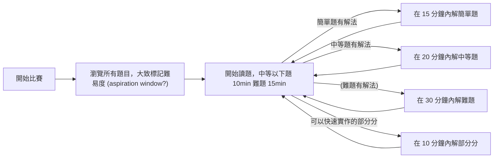

# Contest Technique

```mermaid
graph LR

st["開始比賽"]

scan["瀏覽所有題目，大致標記難易度 (aspiration window?)"]

read["開始讀題，中等以下題 10min 難題 15min"]

solve_easy["在 15 分鐘內解簡單題"]
solve_medium["在 20 分鐘內解中等題"]
solve_hard["在 30 分鐘內解難題"]
solve_easy_partial["在 10 分鐘內解部分分"]

st --> scan --> read

read -- "簡單題有解法" --> solve_easy --> read
read -- "中等題有解法" --> solve_medium --> read
read -- "(難題有解法)" --> solve_hard --> read
read -- "可以快速實作的部分分" --> solve_easy_partial --> read

```