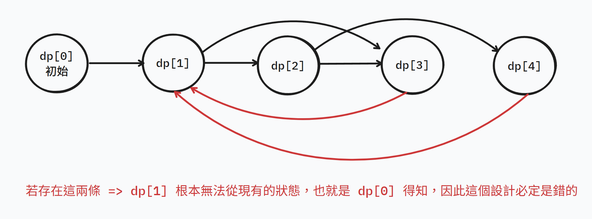

# dp

## 核心知識點

dp 是一種將**子問題的答案**紀錄下來以**解決大問題**的技巧。

---

## 介紹

### 狀態

一個 dp 的狀態，就是一個 dp 中的**子問題該儲存的東西**，來讓之後的**轉移**可以快速操作。

一個合理的 DP 狀態應符合：

1. 最佳子結構：大問題的最佳解必有部分在其**子問題的最佳解中**。
2. 將轉移與狀態化成圖後 (點：狀態；邊：轉移)，必須是 Directed Acyclic Graph (**DAG**, 有向無環圖)。

另外 DP 設計若滿足**子問題重疊**，才會顯示出 DP 的強大，反之則是普通分治問題。

> 若 DP 狀態有環出現，會使狀態更新時無法從現有的狀態得知，那其餘狀態更新時就必定錯。

### 轉移

一個 dp 的轉移，就是讓**子問題合併時該做的操作**。有**好的狀態設計才有好的轉移複雜度**，這也是整個 dp 時間複雜度最為關鍵的因素之一。

通常狀態與轉移可以用簡單的代號來描述狀態設計與轉移複雜度。常見的 dp 模型描述如下：

| DP 模型 | 狀態 | 轉移 | 時間複雜度 |
| - | - | - | - |
| 1D0D | 一維 | 常數 | $O(n)$ |
| 1D1D | 一維 | $O(n)$ | $O(n^2)$ |
| 2D0D | 二維 | 常數 | $O(n^2)$ |
| 2D1D | 二維 | $O(n)$ | $O(n^3)$ |

### 種類

常見的 dp 可由型態分類為：

1. Top-down dp：由上而下的，直觀的，以遞迴形式寫成的 dp 就是 **top-down dp**。也被稱作 **Memorize Search**。
2. Bottom-up dp：由下而上的，抽象的，以迴圈形式寫成的 dp 就是 **bottom-up dp**。

而 bottom-up dp 又可依轉移分為：

1. Pull：拉取式的，把之前算過的狀態拉過來，來計算此狀態就是 pull 轉移。
2. Push：推送的，把算好的狀態推到沒算過的狀態，來更新其他狀態的就是 push 轉移。

---

## 常見模型

| DP 模型 | 關鍵字 | 大致解法 |
| - | - | - |
| 背包問題 | 限制容量、項目填入 | TODO |
| [二維地圖](/Coding_Practice/techniques/dp/path_on_grid) | 地圖、移動方向受限 | TODO |
| [區間問題](/Coding_Practice/techniques/dp/range_dp) | 可以拆成連續子區間的子問題 | `dp[l][r] := 區間 [l, r] 的答案` |

## 常見錯誤

- 錯誤 1
- 錯誤 2

## 代表題目

| 題目 | 重點 |
| --- | --- |
| AtCoder xxx | xxx |
| USACO xxx | xxx |

## Agent Prompt

> 請你扮演這個知識點的老師，按照本文的介紹詮釋這個知識點。
> 若本文知識點有誤，請點出錯誤的地方並予以修正。
