# Range dp 區間 dp

## 這個 skill 解決什麼問題？

需要用動態規劃概念維護區間內資訊的 dp。

## 使用時機

子序列問題，凸多邊形三角化問題，刪除最前項與最後項。

## 核心想法

用 `dp[l][r]` 紀錄區間 $[l, r]$ 的答案，而根據轉移的不同可以分為兩種：

| DP 模式 | 解釋 | 時間複雜度 |
| - | - | - |
| 2D0D | 不需要額外枚舉的區間 DP | $O(n^2)$ |
| 2D1D | 需要 `for (i = l ~ r)` 轉移的 DP | $O(n^3)$ |

## 思考流程

思考一個狀態 $dp[l][r]$ 如何從其他狀態推出，就像線段樹一樣。

## 常見模型

### 2D0D 區間 dp

這類區間 dp 的轉移通常由 $dp[l + 1][r], dp[l][r - 1], dp[l + 1][r - 1]$ 這類狀態而來。

通常這類區間 dp 會搭配前綴和、集合加減法、排容原理。

### 2D1D 區間 dp

這類區間 dp 的轉移通常由 $dp[l][k], dp[k][r]$ 這類需要再枚舉 $k$ 的狀態而來。

### 凸多邊形三角化問題

要把一個凸多邊形三角化，可以看成是：

在區間 $[l, r]$ 中的點挑一個，把整個凸多邊形拆成：多邊形1，三角形，多邊形2，再繼續遞迴下去。

因此，一個簡單的 Memorized Search 實作如下：

::: details 實作

<<<@/problems/subjects/range_dp/1039.Minimum_Score_Triangulation_of_Polygon.cpp

:::

## 常見錯誤

1. 使用 Memorized Search 與 Bottom-up 的時間會相差兩倍，因此，建議先使用 Memorized Search 確認 dp 正確，再轉成 Bottom-up 壓常數。

## 代表題目

| 題目 | 重點 |
| --- | --- |
| [CSES Empty String](https://cses.fi/problemset/task/1080/) | TODO |

## Agent Prompt

> 請你扮演這個 skill 的教練，按照本文的思考流程分析題目。
