# Tree dp 樹 dp

## 這個 skill 解決什麼問題？

樹上的計數、最佳化問題。

## 使用時機

**每一點的答案可以從子節點推出**。

## 介紹

樹 dp，也就是在樹上做 dp，有兩種形式：

1. 可直接從子節點合併的 dp。
2. 子節點的選擇會影響合併的 dp。

而兩種形式的 dp 也都有各自的思考方式。

幾種分辨方式如下：

1. 觀察**子節點的狀態是否彼此獨立**，若會互相影響就是子樹合併 dp。
2. 是否需要**枚舉主樹與子樹的狀態**，若需要就是子樹合併 dp。
3. 消去樹邊形成連通塊、選點，常常會是子樹合併 dp。

## 常見模型

### 距離轉路徑

在樹上，**兩點的最短路就是其唯一的路徑**，透過這樣的轉換可以使題目變的更簡單。

### 可以直接合併的 dp

這些題目的 dp 轉移可以直接從子節點合併，因此，只要狀態與轉移正確就可以快速解題。

一種思考方式為：想想**父節點的答案如何從子節點透過加總、取最大最小值... 轉移而來**。

### 和父節點的父節點有關

若子樹的狀態與「父節點的父節點」有關，就需要在 dp 狀態中多考慮「父節點的狀態」。

### 子樹合併 dp

子樹合併 dp，指的是 dp 合併時，必須一邊合併子樹，一邊考慮其他子樹。可以將合併過程想像如：

因此，在 dp 轉移時，還要考慮已經合併的主樹 dp 狀態。

這裡推薦一種思考方式：

可以化成這個簡圖，並將 $dp[x][\cdot], dp[y][\cdot]$ 標上其真正的意義，就可以比較直觀的模擬子樹合併的過程，輔助思考。

## 常見錯誤

TODO

## 代表題目

| 題目 | 重點 |
| --- | --- |
|  | 子樹合併 dp |
|  | 與父節點的父節點有關 |

## Agent Prompt

> 請你扮演這個 skill 的教練，按照本文的思考流程分析題目。
