# Vector 向量

## 這個 skill 解決什麼問題？

向量之間的夾角（銳角、直角、鈍角），點到直線距離，向量之間的轉向（順時針、逆時針），向量之間平行，

## 使用時機

幾何問題。

## 介紹

向量是兩點之間的差，而對兩向量做內積（點積）與外積（叉積）就可以更方便的判斷各種幾何關係。

### 內積（點積）

兩向量 $\vec{a} = (a_x, a_y), \vec{b} = (b_x), b_y$ 的內積定義為：

$$\vec{a} \cdot \vec{b} = |\vec{a}||\vec{b}|\cos\theta = a_xb_x + a_yb_y$$

::: details 證明

考慮由 $\vec{a}, \vec{b}$ 構成的三角形，則第三邊為 $\vec{a} - \vec{b}$。

其長度平方 $|(\vec{a} - \vec{b})|^2 = (a_x - b_x)^2 + (a_y - b_y)^2$

也就會是餘弦定理的 $|\vec{a}|^2 + |\vec{b}|^2 - 2 |\vec{a}| |\vec{b}| \cos \theta$

列成方程式：

$$
\begin{aligned}
(a_x - b_x)^2 + (a_y - b_y)^2 &= |\vec{a}|^2 + |\vec{b}|^2 - 2 |\vec{a}| |\vec{b}| \cos \theta\\
(a_x^2 + b_x^2 - 2a_xb_x) + (a_y^2 + b_y^2 - 2a_yb_y)^2 &= |\vec{a}|^2 + |\vec{b}|^2 - 2 |\vec{a}| |\vec{b}| \cos \theta\\
|\vec{a}|^2 + |\vec{b}|^2 - 2(a_xb_x + a_yb_y) &= |\vec{a}|^2 + |\vec{b}|^2 - 2 |\vec{a}| |\vec{b}| \cos \theta\\

- 2(a_xb_x + a_yb_y) &= - 2 |\vec{a}| |\vec{b}| \cos \theta\\

a_xb_x + a_yb_y &= |\vec{a}| |\vec{b}| \cos \theta\\
\end{aligned}
$$

:::

而這個內積就可以利用 $\cos\theta$ 來判斷兩向量的夾角關係。

### 外積

外積是三維坐標系上的操作，而競程中使用的是 $\vec{a} \times \vec{b}$。

而外積公式為：

$$
|\vec{a} \times \vec{b}|=
a_xb_y - a_yb_x =
|\vec{a}||\vec{b}| \sin \theta
$$

::: details 證明

TODO

:::

## 模板

```c++
struct Vec {
    ll x, y;

    Vec operator-(const Vec &b) const
    {
        return {x - b.x, y - b.y};
    }
};

ll dot(Vec a, Vec b)
{
    return a.x * b.x + a.y * b.y;
}

ll cross(Vec a, Vec b)
{
    return a.x * b.y - a.y * b.x;
}
```

## 常見模型

### 向量的夾角

由於**內積**的定義為

$$\vec{a} \cdot \vec{b} = |\vec{a}||\vec{b}|\cos\theta = a_xb_x + a_yb_y$$

又由於 $\cos0\degree \sim \cos90\degree$ 為正，$\cos90\degree \sim \cos180\degree$ 為負，因此：

1. 若內積 $\ge 0$，則兩向量成銳角。
2. 若內積 $= 0$，則兩向量成直角。
3. 若內積 $\le 0$，則兩向量成鈍角。

### 向量的轉向

由於外積的定義：

$$
\vec{a} \times \vec{b}=
|\vec{a}||\vec{b}| \sin \theta
$$

又因為 $\sin(-\theta) = -\sin\theta$，因此：

1. 當 $\vec{a}\rightarrow\vec{b}$ 的有向角為負，則 $\vec{a}\times\vec{b} < 0$，轉向為順時針。
2. 當 $\vec{a}\rightarrow\vec{b}$ 的有向角為正，則 $\vec{a}\times\vec{b} > 0$，轉向為逆時針。
3. 當 $\vec{a}\rightarrow\vec{b}$ 的有向角為 $0$，則 $\vec{a}\times\vec{b} = 0$，兩向量平行。

### 向量夾成的面積

外積可以是兩向量所構成的平行四邊形的面積。因此，兩向量夾成的三角形面積是：

$$\triangle area=\frac{|\vec{a} \times \vec{b}|}{2}$$

### 點線距



由上圖可推出：

$$
d = \frac{|\vec{a} \times \vec{b}|}{|\vec{a}|}
$$

### 點線段距

TODO

## 常見錯誤

- 錯誤 1
- 錯誤 2

## 代表題目

| 題目 | 重點 |
| --- | --- |
| AtCoder xxx | xxx |
| USACO xxx | xxx |

## Agent Prompt

> 請你扮演這個 skill 的教練，按照本文的思考流程分析題目。
