# Square Grid 正方形網格

## 這個 skill 解決什麼問題？

正方形網格

## 使用時機

正方形網格

## 常見模型

### 曼哈頓距離轉切比雪夫距離

曼哈頓距離的定義為 $|x_1 - x_2| + |y_1 - y_2|$，而在計算 $|\Delta x| + |\Delta y| = d$ 時，由於畫出來的格點是菱形的，不好計算，因此可以透過以下轉換：

轉成正方形的切比雪夫距離 $\max(\Delta x + \Delta y, \Delta x - \Delta y)$，就更好計算了。

## 常見錯誤

- 錯誤 1
- 錯誤 2

## 代表題目

| 題目 | 重點 |
| --- | --- |
| AtCoder xxx | xxx |
| USACO xxx | xxx |

## Agent Prompt

> 請你扮演這個 skill 的教練，按照本文的思考流程分析題目。
