# LCA 最近共同祖先

## 這個 skill 解決什麼問題？

樹上路徑問題。

## 使用時機

路徑問題。

## 介紹

最近共同祖先指的是：兩點向樹根前進最先遇到的共同點。

由於有根樹是「唯一環為根節點自環」的特殊函數圖，所以**通常使用倍增來做函數圖的跳躍**。

所以，一個簡單的模板架構如下：

```text
add_edge(u, v) 在 tree 中加邊

build()
{
    dfs 遍歷每個點，為其建構倍增表
}

jump(x, d) 快速從 x 跳 d 步

lca(a, b)
{
    將 a, b 的 depth 變成一樣

    在倍增表上二分搜：距離 LCA 最近的點

    回傳 jump(此點, 1)
}
```

::: details 模板

```c++
struct LCA
{
    int n;
    const int LOG = 20;
    vector<vector<int>> e;
    vector<vector<int>> up;
    vector<int> depth;
    LCA(int _n) : n(_n), e(_n), up(_n, vector<int>(LOG)), depth(_n) {};

    void add_edge(int u, int v)
    {
        e[u].push_back(v);
    }

    void build(int root)
    {
        auto dfs = [&](auto self, int x, int p) -> void
        {
            up[x][0] = p;
            for (int k = 1; k < LOG; k++)
            {
                up[x][k] = up[up[x][k - 1]][k - 1];
            }

            for (auto y : e[x])
            {
                if (y == p) continue;
                
                depth[y] = depth[x] + 1;
                self(self, y, x);
            }
        };
        
        dfs(dfs, root, root);
    }

    int jump(int from, int d)
    {
        for(int k = 0; k < LOG; k++)
        {
            if ((d >> k) & 1)
            {
                from = up[from][k];
            }
        }

        return from;
    }

    int lca(int a, int b)
    {
        if (depth[a] > depth[b]) swap(a, b); // depth[a] < depth[b]
        b = jump(b, depth[b] - depth[a]);

        if (a == b) return a;

        for (int k = LOG - 1; k >= 0; k--)
        {
            if (up[a][k] != up[b][k])
            {
                a = up[a][k];
                b = up[b][k];
            }
        }

        return up[a][0];
    }
};
```

:::

## 常見模型

### 兩點間的距離

兩點間的距離可以拆成 $dis(u, lca) + dis(lca, v)$，而這個 $dis()$ 在處理 LCA 時就已經求出了。

### 樹上前綴和

樹上前綴和可以快速求出一條路徑上的 XX 總和，一種好寫的想法是：

$$pre[x] = pre[parent[x]] + w[x]$$

這是把**父節點的前綴和推給子節點**，而查詢時就可以利用 LCA 將路徑拆成兩段：

$$sum(lca, u) + sum(lca, v)$$

而 $sum(lca, p)$ 有兩種可能。

1. 權重在點上，則：
$$sum(lca, u) + sum(lca, v) = (pre[u] - pre[lca]) + (pre[v] - pre[lca]) + w[lca]$$
2. 權重在邊上，則：
$$sum(lca, u) + sum(lca, v) = (pre[u] - pre[lca]) + (pre[v] - pre[lca])$$

::: info 為何權重在點上與在邊上有差？

這是點上權重的示意圖：



這是邊上權重的示意圖：



:::

### 樹上差分

樹上差分是樹上前綴和的延伸，但為了方便處理路徑，因此會把前綴和改成：**子節點回傳給父節點**。

通常差分的權重會加在點上，因此，整個差分需要變更的節點是：

`diff[u]++, diff[v]++, diff[lca]--, diff[parent[lca]]--`。

### 點是否在路徑上

TODO

### 路徑是否相交

TODO

## 常見錯誤

TODO

## 代表題目

| 題目 | 重點 |
| --- | --- |

## Agent Prompt

> 請你扮演這個 skill 的教練，按照本文的思考流程分析題目。
