# Euler Tour Technique 樹壓平

## 這個 skill 解決什麼問題？

子樹問題。

## 使用時機

求子樹的總和、最大最小值...

## 介紹

將 DFS 走訪的路程記錄下來並標上最先節點與最後節點，就可以用新的編號把樹上的點變成區間。



只需要在 DFS 的開始與結尾，記錄 `tin` 與 `tout`，就可以用新的編號知道某一點的子樹節點。

一種以 $[tin_i, tout_i]$ 代表的編號方式實作如下：

```c++
int tt = 0;
vector<int> tin(n + 1), tout(n + 1);
auto dfs = [&](auto self, int x, int p) -> void
{
    tin[x] = ++tt;
    for (auto y : e[x]) 
    {
        if (y != p) self(self, y, x);
    }
    tout[x] = tt;
}; dfs(dfs, root, root);
```

## 常見模型

### 拓撲排序

依照 `tin` 排序的點，其實是更嚴謹的拓撲排序。畢竟他不僅使所有子節點都在父節點後面（拓撲排序的定義），更讓每個子樹的順序都排在一起。

## 常見錯誤

TODO

## 代表題目

| 題目 | 重點 |
| --- | --- |

## Agent Prompt

> 請你扮演這個 skill 的教練，按照本文的思考流程分析題目。
